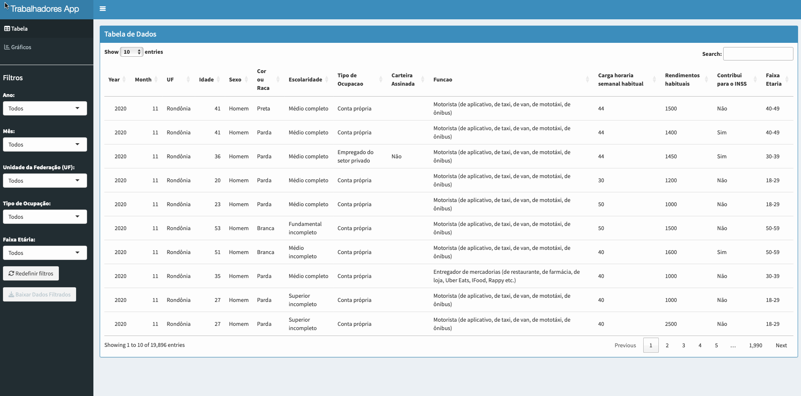

# The Precarious Reality of Platform Work: A Deep Dive into Brazil's Gig Economy During the Pandemic
### Using R and public microdata to uncover the demographics, income, and working conditions of over 19,000 app-based drivers and delivery workers.

---

Photo by Bruno Saito no [Pexels](https://www.pexels.com/pt-br/foto/estrada-via-homem-bicicleta-16184010/)

## Introduction


Platform-based work has been expanding rapidly across the globe, creating new forms of labor relations. During the COVID-19 pandemic, city streets in Brazil became dominated by a new, essential workforce: app-based drivers and delivery workers. While demand for their services surged, the reality of their working lives remained largely invisible, hidden behind corporate platforms. Who are these workers? What are their working conditions? And what does their reality tell us about the future of work?

To address this information gap, researchers have turned to demographic surveys that can represent platform workers at scale. This project utilizes [**PNAD COVID-19**](https://www.ibge.gov.br/estatisticas/sociais/saude/27946-divulgacao-semanal-pnadcovid1.html?=&t=o-que-e), a special edition of Brazil's National Household Sample Survey conducted during the pandemic, to analyze the profile and working conditions of gig economy workers.

By analyzing the microdata of **19,896 platform workers** from May to November 2020, we can paint a clear, data-driven picture of the gig economy in Brazil.

---

## Why PNAD COVID-19?

The PNAD COVID-19 survey is an invaluable resource because it provides **monthly labor indicators** that allow researchers to track employment trends over time. Also includes specific categories that enable the identification of app-based delivery workers and drivers.

In this study:

- **App delivery workers** were identified by combining respondents who reported working as "Motoboys" and "Delivery workers (from restaurants, pharmacies, shops, Uber Eats, iFood, Rappi, etc.)."
- **App drivers** were categorized under "Drivers (for apps, taxis, vans, mototaxis, buses)."

The analysis focused on workers who reported being **self-employed** or working in the private sector **without formal contracts**, reflecting the informal nature of most platform jobs in Brazil.

---
## Project Structure and Reproducibility

### System Requirements

- R version 4.0 or higher
- Required R packages: `tidyverse`, `PNADcIBGE`, `COVIDIBGE`, `knitr`, `gridExtra`, `ggrepel`, `survey`, `zoo`, `scales`, `srvyr`

### Installation

```bash
git clone https://github.com/melogabriel/PNADCovid-workplatform.git
cd PNADCovid-workplatform
```

Install the required packages:

```r
install.packages(c("tidyverse", "PNADcIBGE", "COVIDIBGE", "knitr", "gridExtra", "ggrepel", "survey", "zoo", "scales", "srvyr"))
```

### Usage

- Open the file `PNADCovid_TrabalhadoresAPP.Rmd` in RStudio.
- Run the notebook to process and analyze the data.
- The results will be displayed in an automatically generated HTML report.


## Methodology

### Data Import and Processing

The PNAD COVID-19 microdata was imported using the R package [`PNADcIBGE`](https://cran.r-project.org/web/packages/PNADcIBGE/index.html), variables including:

- Age, gender, race, and education level.
- Hours worked per week and monthly earnings.
- Whether the worker contributed to Brazil's public social security system (INSS).

Data from **May to November 2020** were used, covering the entire survey period and the initial peak of the pandemic in Brazil.

### Data Filtering and Database Structuring

#### Variable Selection and Dictionary Mapping

The PNAD COVID-19 dataset contains an extensive list of variables. To focus the analysis on platform-based workers, the following key variables were selected based on the [PNAD COVID-19 data dictionary](https://github.com/melogabriel/PNADCovid-workplatform/blob/main/Dicionario_PNAD_COVID_112020_20210726.xls):

- **UF (State):** Regional identification to allow geographic filtering.
- **A002 (Age):** Continuous variable indicating the respondent’s age.
- **A003 (Sex):** Coded as 1 (Male) or 2 (Female).
- **A004 (Race/Color):** Categorized as White, Black, Brown (Pardo), Yellow (Asian), or Indigenous.
- **A005 (Education Level):** Stratified into basic, secondary, and higher education.
- **C007 (Performed Paid Work):** Identifies whether the individual engaged in paid work during the reference week.
- **C007B (Employed under formal contract):** Specifically flags whether the work was conducted via transportation or delivery platforms.
- **C007C (Function):** Captures other forms of platform-based work not related to transportation.
- **C008 (Weekly Hours Worked):** Essential to measure work intensity and compare across groups.
- **C009 (Monthly Earnings from All Jobs):** Used to calculate income levels.
- **Contributing to INSS:** Captures whether the respondent contributes to social security.

#### Filtering Logic

The filtering steps applied to the raw PNAD COVID-19 microdata were as follows:

1. **Timeframe Selection:** Only records from **May to November 2020** were included, matching the period when the PNAD COVID-19 was conducted monthly by IBGE.

Timeframe Selection example:
```r
pnad_covid_may = get_covid(year=2020, month=5, vars=c("UF", "A002", "A003", "A004","A005", "C007", "C007B", "C007C", "C008", "C009", "C01012", "C011A12", "C014"), design=FALSE, labels=TRUE) 
```

2. **Work Status:** The analysis focused on respondents who:

   - Reported performing paid work.
   - Declared themselves as **self-employed** or **private-sector employees without a formal contract.**
   - Delivery workers were selected by combining responses that indicated "Motoboy" and "Delivery of goods (restaurants, pharmacies, shops, Uber Eats, iFood, Rappi, etc.)."
   - Drivers were selected based on the response option "Driver (app-based, taxi, van, mototaxi, bus)."

Workers App status filter example:
```r
workersAPP_may <- filter(pnad_covid_may, 
                                C007 == 'Conta própria' | C007 == 'Empregado do setor privado',
                                C007B == 'Não' | is.na(C007B),
                                C007C == 'Motoboy,' | C007C == 'Entregador de mercadorias (de restaurante, de farmácia, de loja, Uber Eats, IFood, Rappy etc.)' | C007C == 'Motorista (de aplicativo, de taxi, de van, de mototáxi, de ônibus)')
# 2736 entries, 26 variables
```
3. **Variable Recoding:**

   - Categorical variables such as race and education level were recoded using labels from the PNAD COVID-19 dictionary to improve readability.
   - Derived variables were created, such as a binary flag for INSS contribution and calculated averages for earnings and working hours.

Variables naming example:
```r
new_names <- c("UF" = "UF", "A002" = "Idade", "A003" = "Sexo", "A004" = "Cor ou Raça", "A005" = "Escolaridade", "C007" = "Tipo de Ocupação", "C007B" = "Carteira Assinada", "C007C" = "Tipo/Cargo/Função", "C008" = "Carga horária semanal habitual", "C009" = "Carga horária semanal", "C01012" = "Rendimentos", "C011A12" = "Rendimentos habituais", "C014" = "Contribui para o INSS")

names(workersAPP_may) <- new_names[names(workersAPP_may)]
```

### Statistical Analysis

The analysis used the R packages `survey` and `srvyr` to apply sampling weights and ensure population-representative estimates. Data manipulation was performed with `tidyverse`, and visualizations were created using `ggplot2` and supporting libraries.

### Interactive Dashboard

To make the results accessible, the project also includes a [**Shiny Dashboard**](https://gabrielmelo.shinyapps.io/PNADCovid-workplatform/), enabling users to:

- Filter data by region, age group, and work category.
- View dynamic charts that update in real time.
- Explore insights without needing to execute code locally.



---

## Key Findings

The consolidated sample included **19,896 platform-based workers**, segmented as follows:

- 13,589 App Drivers
- 4,347 Delivery Workers (Uber Eats, iFood, Rappi, etc.)
- 1,960 Motoboys


**Demographic Profile:**

- 94.57% male


- 62.1% self-identified as Black or Brown (pardo or preto)


- Average age: 40.02 years

  
- 62% of workers have, at most, a complete high school education


**Work Conditions:**

- Average workweek: 42.3 hours


- Average monthly income: R$1,265


- 74.2% did not contribute to the INSS


This findings highlight the **informal, male-dominated, and racially marked nature of platform-based work** in Brazil. Most workers in this sector are not covered by social protections and work under precarious conditions.

---


## Final Thoughts: Data as a Tool for Visibility

The gig economy is often presented as a modern, innovative, and flexible way to work. However, a detailed, large-scale data analysis tells a different story: one of long hours, low pay, and a profound lack of social protection. The profile of these workers—predominantly male, Black or Brown, with limited formal education—highlights systemic inequalities that extend into these new forms of labor.

By combining public microdata and open-source tools, we can move beyond anecdotes and bring a new level of transparency to the platform economy. This approach is fully reproducible and provides a solid foundation for researchers, policymakers, and the public to understand the true dimensions and social impacts of this growing workforce. In this way, it hopes to contribute with ways of obtaining information about this new form of work that is still little known in terms of its dimensions and social impacts.

---

## Academic Reference, Code and Contact

This project is part of the author’s master's dissertation:

> MELO, Gabriel Coutinho. *Plataformização do trabalho no Brasil: uma análise das suas origens e condicionantes*. 2024. 103 f. Master's Dissertation — Universidade Federal Fluminense. [Access the dissertation here.](https://app.uff.br/riuff/handle/1/36524)

The codes are available on my [Github](https://github.com/melogabriel/PNADCovid-workplatform). You can also find me on [LinkedIn](https://www.linkedin.com/in/gabriel-melo/).

